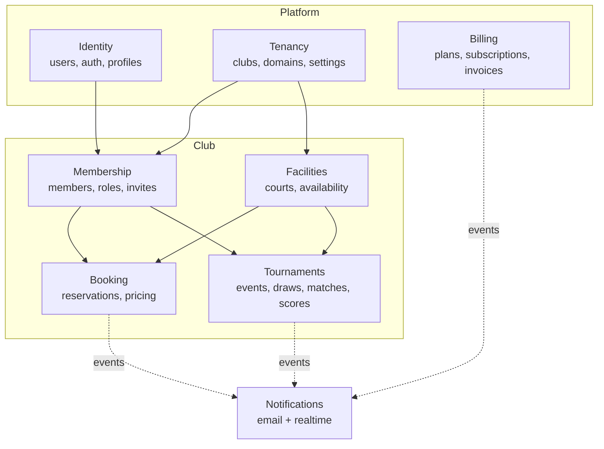
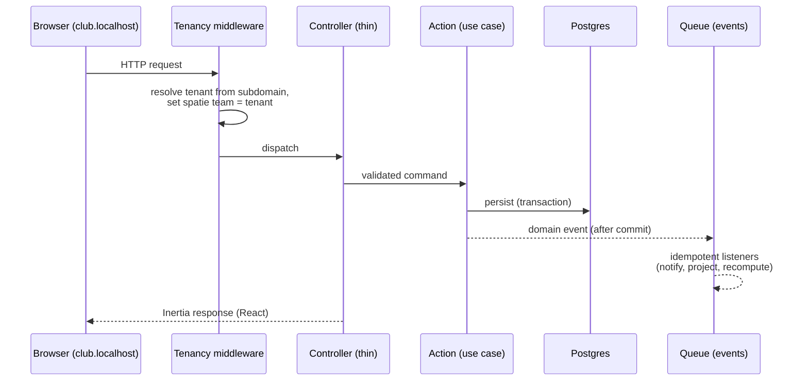

# Architecture Overview

OpenTennis is a **multi-tenant SaaS** for tennis clubs: members book courts and clubs run
tournaments. One Laravel application serves every club; a club is a **tenant**.

## Tech stack

| Layer | Choice |
| --- | --- |
| Language / framework | PHP 8.4 · Laravel 12 |
| Database (runtime) | PostgreSQL 17 — schema kept **DB-neutral** via Eloquent (see [ADR-0001](../adr/0001-postgres-but-db-neutral.md)) |
| Frontend | React 19 + TypeScript + Inertia v2 + Vite + Tailwind v4 + shadcn/ui |
| Multi-tenancy | `stancl/tenancy` — single database, row-level, subdomain identification |
| Authorization | `spatie/laravel-permission` — roles scoped per club; platform super-admin via a flag |
| Async / realtime | Redis + queued listeners (Horizon), Reverb (WebSockets) — added as features need them |
| Tests | Pest (unit/feature) + Playwright (E2E), Pint, Larastan |

## Bounded contexts (DDD)

The application is organised into bounded contexts under `app/Domains/<Context>` (see
[ADR-0002](../adr/0002-ddd-module-layout.md)). Each owns its models, application Actions,
domain events, listeners/projections, policies, and DTOs.

## Multi-tenancy model

- **Single database, row-level isolation.** Tenant-owned tables carry `tenant_id`; the
  `BelongsToTenant` trait adds a global scope. No per-tenant databases.
- **Subdomain identification.** `localhost` / apex = central (marketing, signup, platform
  admin); `<club>.<central>` = the club app. Central and tenant routes are domain-constrained.
- **Two axes of authority:** per-club roles (spatie teams, `team_id == tenant_id`) and a
  platform super-admin (`users.is_platform_admin` + `Gate::before`).

## Request lifecycle (tenant request)

## Runtime topology (Docker)

`docker compose up --build` starts: **tennis-web** (Apache + mod_php, runs migrations +
scheduler + queue worker via supervisord), **tennis-postgres** (Postgres 17), **tennis-redis**
(cache/queue/sessions), **tennis-mailpit** (captured email in dev). See [docker/](../../docker)
and the root `docker-compose.yml`.

## Where to read next

- Decisions: [docs/adr/](../adr)
- Database: [docs/db/erd.md](../db/erd.md)
- Events: [docs/events/event-catalog.md](../events/event-catalog.md)
- Design system: [docs/ui/design-system.md](../ui/design-system.md)
- Features: [docs/features/](../features)
