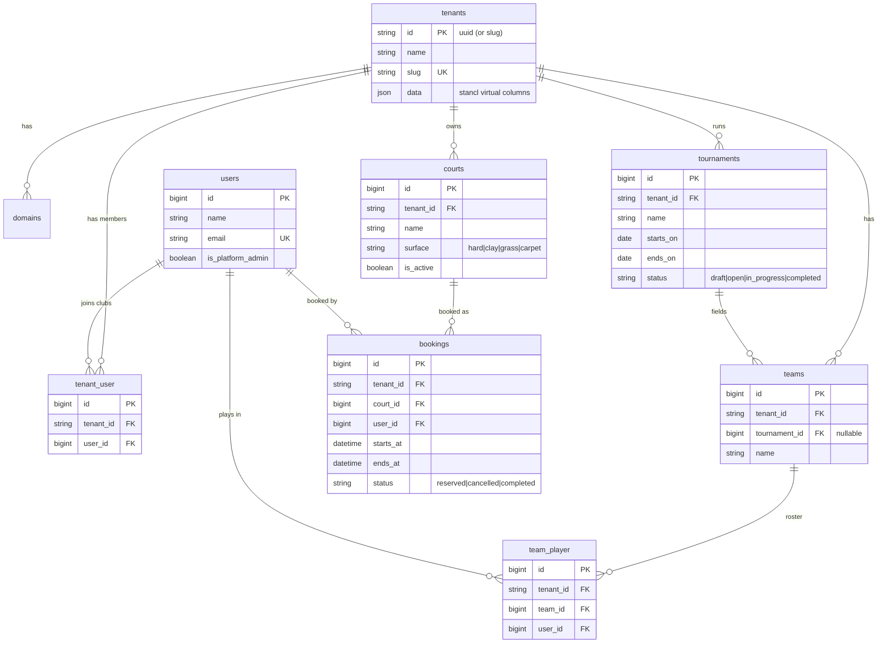

# Database Schema (ERD)

DB-neutral schema (see [ADR-0001](../adr/0001-postgres-but-db-neutral.md)). Tenant-owned tables
carry `tenant_id`. This reflects the **current** schema and grows with each feature slice.

> Roles/permissions tables (`roles`, `permissions`, `model_has_roles`, …) come from
> `spatie/laravel-permission` with `team_foreign_key = tenant_id` (string). See
> [ADR-0005](../adr/0005-single-database-multitenancy.md).

## Evolution note

The feature slices will introduce: `court_availability`, `court_blackouts`, `pricing_rules`,
`memberships`/`invitations`, tournament `categories`, `registrations`, `draws`, `matches`,
`scores`, billing `plans`/`subscriptions`/`invoices`, and `notifications`. As primary keys
migrate to UUID per ADR-0001, this diagram is updated accordingly.
