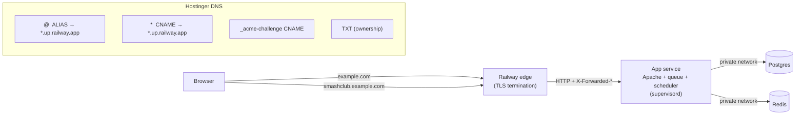

# Deploying Open Courts to Railway (Docker image)

Status: **proposal / for review**. This documents the changes required to run the existing
`docker/Dockerfile` image on [Railway](https://railway.com) with a custom domain on
**Hostinger** DNS. Nothing here is applied yet — review the "Required repo changes" section,
then we apply + test.

## Why this app is slightly special

This is **subdomain-based multi-tenancy**: the central app runs on the apex
(`example.com`) and every club runs on a wildcard subdomain (`<slug>.example.com`).
`InitializeTenancyBySubdomain` resolves the tenant from the `Host` header, and the single
Apache vhost already serves any host — so the whole platform is **one container + two DNS
records** (apex + wildcard). Railway supports wildcard custom domains and Hostinger can serve
both the apex (via an **ALIAS** record) and the wildcard, so no Cloudflare migration is needed.



## Architecture on Railway

| Concern | Where it runs |
|---|---|
| Web + queue worker + scheduler | **One** service built from `docker/Dockerfile` (already bundled via `supervisord`) |
| Database | **Postgres** service (reference its vars) |
| Cache / session / queue backend | **Redis** service |
| TLS (apex + wildcard) | Auto-issued by Railway (wildcard cert via `_acme-challenge` DNS-01) |
| Central domain | `example.com` custom domain |
| Club subdomains | `*.example.com` wildcard custom domain |

> **Do not horizontally scale this service.** The scheduler runs *inside* the web container,
> so 2+ replicas would double-fire scheduled jobs. Keep 1 replica; if we outgrow it, split a
> separate worker service (same image, `schedule:work` + `queue:work`) and disable those
> programs in the web container's `supervisord.conf`.

---

## Required repo changes (review these)

### 1. Trust Railway's TLS-terminating proxy — `bootstrap/app.php`

Railway terminates TLS at the edge and forwards plain HTTP with `X-Forwarded-*` headers.
Without trusting the proxy, Laravel sees `http`, generates `http://` URLs, and refuses to set
secure cookies — which breaks the cross-subdomain session cookie and login.

```diff
 ->withMiddleware(function (Middleware $middleware) {
+    // Railway (and any PaaS) terminates TLS at the edge and forwards HTTP with
+    // X-Forwarded-* headers. Trust it so https is detected and secure cookies are set.
+    $middleware->trustProxies(at: '*');
+
     // Bounce localhost / 127.0.0.1 to the canonical central domain ...
     $middleware->prepend(RedirectToCentralDomain::class);
```

### 2. Don't regenerate `APP_KEY` on every boot — `docker/start.sh`

On Railway there is **no `.env` file** (vars come from the dashboard), so the current guard
runs `key:generate` on every deploy → a **new key each time** → all sessions/encrypted data
silently invalidated. Generate the key once (`php artisan key:generate --show`), set it as a
Railway variable, and skip generation when it's present.

```diff
-if ! grep -qE '^APP_KEY=.+' .env 2>/dev/null; then
+if [ -z "${APP_KEY:-}" ] && ! grep -qE '^APP_KEY=.+' .env 2>/dev/null; then
     echo "🔑 Generating application key..."
     php artisan key:generate --force --no-interaction
 fi
```

### 3. Listen on Railway's injected `$PORT` — `docker/start.sh`

Railway injects `PORT` and routes to it. Patch Apache's listen port at boot (defaults to 80
locally, so `docker-compose` is unaffected). Add just before the `supervisord` exec:

```bash
###############################################################################
# 6.5 Bind Apache to the platform-provided port ($PORT on Railway; 80 locally).
###############################################################################
APP_PORT="${PORT:-80}"
sed -ri "s/^Listen .*/Listen ${APP_PORT}/" /etc/apache2/ports.conf
sed -ri "s/<VirtualHost \*:[0-9]+>/<VirtualHost *:${APP_PORT}>/" /etc/apache2/sites-available/000-default.conf
```

### 4. Point Railway at the Dockerfile — new file `railway.json` (repo root)

Railway only auto-detects `./Dockerfile`; ours lives in `docker/`. This also wires the health
check to `/up` (already exempt from `RedirectToCentralDomain`).

```json
{
  "$schema": "https://railway.com/railway.schema.json",
  "build": { "builder": "DOCKERFILE", "dockerfilePath": "docker/Dockerfile" },
  "deploy": { "healthcheckPath": "/up", "healthcheckTimeout": 300, "restartPolicyType": "ON_FAILURE" }
}
```

> All four changes are isolated and **do not affect local `docker-compose` or the test suite**
> (`PORT` is unset locally → falls back to 80; `APP_KEY` guard only adds a condition; the
> `trustProxies` line is inert without a forwarding proxy).

---

## Railway setup steps

1. **New Project → Deploy from GitHub repo** → select this repo. Railway reads `railway.json`
   and builds `docker/Dockerfile`.
2. **+ New → Database → Postgres**, then **+ New → Database → Redis**.
3. Generate the app key locally: `php artisan key:generate --show` → copy the `base64:...` value.
4. Set the environment variables below on the **app** service.
5. Add the two custom domains (apex + wildcard), then create the DNS records on Hostinger.
6. Deploy. `docker/start.sh` runs `php artisan migrate --force` automatically on boot.
7. Bootstrap the first platform admin (see below).

## Environment variables (app service)

Use Railway `${{Service.VAR}}` references so credentials live in one place. Adjust the
`Postgres` / `Redis` service names to match what you created.

```bash
APP_NAME="Open Courts"
APP_ENV=production
APP_DEBUG=false
APP_KEY=base64:PASTE_FROM_key_generate
APP_URL=https://example.com
CENTRAL_DOMAIN=example.com
LOG_CHANNEL=stderr            # surfaces app logs in Railway's log viewer

# Session shared across club subdomains, secure behind TLS
SESSION_DRIVER=redis
SESSION_DOMAIN=.example.com   # leading dot → valid on example.com AND *.example.com
SESSION_SECURE_COOKIE=true

# Postgres (private network)
DB_CONNECTION=pgsql
DB_HOST=${{Postgres.PGHOST}}
DB_PORT=${{Postgres.PGPORT}}
DB_DATABASE=${{Postgres.PGDATABASE}}
DB_USERNAME=${{Postgres.PGUSER}}
DB_PASSWORD=${{Postgres.PGPASSWORD}}

# Redis (cache + queue + session)
REDIS_CLIENT=phpredis
REDIS_HOST=${{Redis.REDISHOST}}
REDIS_PORT=${{Redis.REDISPORT}}
REDIS_PASSWORD=${{Redis.REDISPASSWORD}}
CACHE_STORE=redis
QUEUE_CONNECTION=redis

# Mail — mailpit is dev-only; use a real transactional provider in prod
MAIL_MAILER=smtp
MAIL_HOST=smtp.your-provider.com
MAIL_PORT=587
MAIL_USERNAME=...
MAIL_PASSWORD=...
MAIL_ENCRYPTION=tls
MAIL_FROM_ADDRESS="hello@example.com"
MAIL_FROM_NAME="Open Courts"
```

Leave `SEED_ON_START` **unset** in production (`DemoSeeder` is demo data).

## Custom domains + DNS

In Railway (app service → **Settings → Networking → Custom Domain**) add **both**, with target
port **80** (or whatever `$PORT` resolved to — the dropdown shows it):

1. `example.com`
2. `*.example.com`

Railway then shows the exact records. The wildcard produces **three** (wildcard CNAME, an
`_acme-challenge` CNAME for the wildcard cert, and a TXT) — all mandatory or it won't verify.

Create these in **Hostinger → hPanel → Domains → DNS records** (copy values verbatim from
Railway):

| Type | Host / Name | Points to (from Railway) | Purpose |
|---|---|---|---|
| **ALIAS** | `@` | `xxxx.up.railway.app` | Central app on the apex (Hostinger flattens) |
| **CNAME** | `*` | `yyyy.up.railway.app` | All club subdomains |
| **CNAME** | `_acme-challenge` | *(Railway value)* | Wildcard TLS issuance |
| **TXT** | *(as Railway shows)* | *(Railway value)* | Ownership verification |

Before adding: **delete Hostinger's default parking `A` record on `@`** (can't coexist with an
ALIAS) and any conflicting `*` / `www` records. Hostinger allows only **one ALIAS** at the root.
SSL is typically issued within ~an hour of DNS resolving.

## First-run platform admin

The console is gated by `is_platform_admin`, which has no signup path by design. After the first
deploy, open the service shell (or `railway run`) and run:

```bash
php artisan tinker --execute="\$u = App\Domains\Identity\Models\User::firstOrCreate(['email'=>'you@example.com'], ['name'=>'You','password'=>bcrypt('CHANGE_ME')]); \$u->forceFill(['is_platform_admin'=>true])->save();"
```

Log in at `https://example.com`; the **Platform admin** nav link appears and `/admin/clubs`
becomes reachable.

## Caveats

- **The free `*.up.railway.app` URL won't fully work** once `CENTRAL_DOMAIN=example.com` — the
  central routes are domain-constrained. Test on the real domain (or temporarily set
  `CENTRAL_DOMAIN` to the railway.app host for a smoke test, knowing club subdomains won't exist
  there).
- **Local file storage is ephemeral** on Railway (`FILESYSTEM_DISK=local` wiped each deploy).
  When club/court photo uploads land, point them at S3 (the `AWS_*` vars are already scaffolded).
  Sessions/cache/queue already live on Redis, so those survive deploys.
- **Migrations run on every boot** via `start.sh`. Fine at one replica; if we ever split
  services, only one of them should run migrations.

## Pre-deploy checklist

- [ ] Repo changes 1–4 applied and `php artisan test` green
- [ ] Postgres + Redis services created
- [ ] `APP_KEY` generated and set as a Railway variable
- [ ] All env vars set (DB/Redis via `${{...}}` references)
- [ ] `example.com` + `*.example.com` added in Railway
- [ ] Hostinger DNS: ALIAS `@`, CNAME `*`, `_acme-challenge` CNAME, TXT — old `A`/`*` removed
- [ ] First deploy green; `/up` returns 200; SSL issued (padlock on apex + a club subdomain)
- [ ] Platform admin bootstrapped; `/admin/clubs` reachable
- [ ] A real club subdomain loads and login persists across central ↔ subdomain

---

### Sources
- [Railway — Working with Domains](https://docs.railway.com/networking/domains/working-with-domains)
- [Railway — Dockerfiles](https://docs.railway.com/guides/dockerfiles)
- [Railway — Public Networking](https://docs.railway.com/guides/public-networking)
- [Hostinger — CNAME vs ALIAS records](https://www.hostinger.com/support/10085192-cname-vs-alias-records-at-hostinger/)
- [Hostinger — Manage ALIAS records](https://www.hostinger.com/support/10067986-how-to-manage-alias-records-at-hostinger/)
