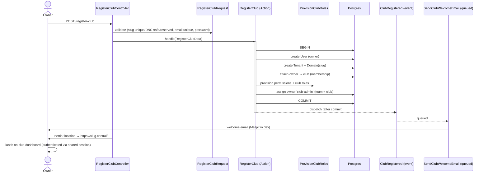

# Feature: Club onboarding

Public signup that provisions a new club (tenant) and its owner in one step, then drops the
owner straight into their club workspace.

## Plain-English flow

1. A prospective club owner visits **`/register-club`** on the central domain.
2. They enter a **club name**, choose a **subdomain** (live-validated, DNS-safe), and their
   **name / email / password**.
3. On submit, the app — in a single transaction — creates the **owner**, the **club**, its
   **subdomain**, makes the owner a **member**, provisions the club's **roles**, and grants the
   owner **`club-admin`**.
4. The owner is **logged in** and redirected to **`https://<slug>.<central>/`** — their club
   dashboard. A **welcome email** is sent asynchronously.

## Sequence

## Key invariants & decisions

- **Atomic provisioning.** Everything happens in one DB transaction; a failure leaves no
  half-created club. The event fires only **after commit** ([ADR-0003](../adr/0003-events-not-event-sourcing.md)).
- **DNS-safe, unique, non-reserved subdomain.** Enforced in `RegisterClubRequest`
  (`^[a-z0-9]+(?:-[a-z0-9]+)*$`, length 3–63, unique on `tenants.slug`, not in a reserved list).
- **Cross-subdomain redirect.** The club is a different origin, so the controller uses
  `Inertia::location()` (a full-page visit for Inertia, a 302 otherwise). The session is shared
  via `SESSION_DOMAIN` = the central domain — locally we use **lvh.me** (`*.lvh.me` → 127.0.0.1)
  so cookies are shared, which `*.localhost` cannot do.
- **Global Vite assets.** `tenancy.asset_helper_tenancy` is `false` so the SPA's JS/CSS load
  from the same origin on every club subdomain.

## Where the code lives

| Concern | File |
| --- | --- |
| Use case | `app/Domains/Tenancy/Actions/RegisterClub.php` |
| Input DTO | `app/Domains/Tenancy/Data/RegisterClubData.php` |
| Role provisioning | `app/Domains/Membership/Actions/ProvisionClubRoles.php` |
| Event | `app/Domains/Tenancy/Events/ClubRegistered.php` |
| Listener + mail | `app/Domains/Notifications/Listeners/SendClubWelcomeEmail.php`, `…/Mail/ClubWelcomeMail.php` |
| HTTP | `app/Http/Controllers/Onboarding/RegisterClubController.php`, `app/Http/Requests/Onboarding/RegisterClubRequest.php` |
| UI | `resources/js/pages/auth/register-club.tsx` |

## Acceptance criteria (tested)

- ✅ Registering provisions tenant + owner + domain + membership + `club-admin` role.
- ✅ `ClubRegistered` is dispatched; the welcome email is sent to the owner.
- ✅ Subdomain must be unique, DNS-safe, and non-reserved.
- ✅ (E2E) Owner completes the form and lands authenticated on their club dashboard.

Tests: `tests/Feature/Onboarding/RegisterClubTest.php` (Pest) · `tests/e2e/club-onboarding.spec.ts` (Playwright).
