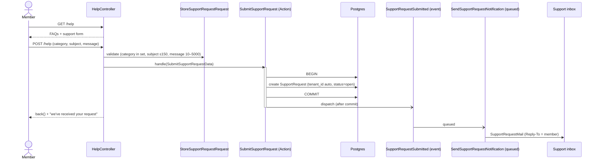

# Feature: Help & support

An in-app Help page (reachable from the topbar in the club shell) where any signed-in club
member can read a few FAQs and file a support request. Submitting records the request
(tenant-scoped) and emails the support inbox asynchronously.

## Plain-English flow

1. A member clicks **Help** in the club topbar → **`/help`** on their club subdomain.
2. The page shows **common questions** plus a **support form**: a topic, a subject, and a
   message.
3. On submit, the app records a **`SupportRequest`** for the current club and shows an in-app
   confirmation.
4. A **`SupportRequestSubmitted`** event fires after commit; a queued listener emails the
   **support inbox** (`config('branding.support_email')`), with the member's address as
   **Reply-To** so support can answer them directly.

## Sequence

## Design notes

- **Bounded context: `Support`.** Model/DTO/Action/Event live under `app/Domains/Support`; the
  notification listener + mailable live under `Notifications` (mirroring the onboarding slice).
- **Tenant-scoped.** `SupportRequest` uses `BelongsToTenant`, so `tenant_id` is auto-filled and
  every query is limited to the current club (covered by an isolation test).
- **Any member may ask for help** — the route is gated by `auth` only, no club-scoped permission.
- **Queued, idempotent notification.** `SupportRequestSubmitted` is `ShouldDispatchAfterCommit`;
  the mailable resolves the club + submitter from the model so it survives running on a worker
  outside the originating tenancy context.

## Where things live

| Concern | File |
| --- | --- |
| Route | `routes/tenant/support.php` (`help.index`, `help.store`) |
| Controller | `app/Http/Controllers/Support/HelpController.php` |
| FormRequest | `app/Http/Requests/Support/StoreSupportRequestRequest.php` |
| DTO / Action | `app/Domains/Support/Data/SubmitSupportRequestData.php`, `Actions/SubmitSupportRequest.php` |
| Model / migration | `app/Domains/Support/Models/SupportRequest.php`, `database/migrations/*_create_support_requests_table.php` |
| Event / listener / mail | `app/Domains/Support/Events/SupportRequestSubmitted.php`, `app/Domains/Notifications/Listeners/SendSupportRequestNotification.php`, `app/Domains/Notifications/Mail/SupportRequestMail.php` |
| Page | `resources/js/pages/help/index.tsx` |
| Tests | `tests/Feature/Support/SupportRequestTest.php`, `tests/e2e/help.spec.ts` |
