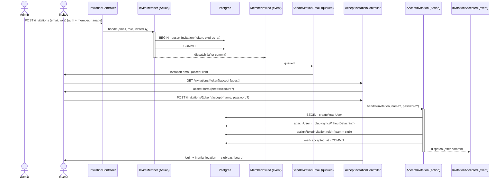

# Feature: Members & invitations

A club admin invites people by email; the invitee follows a tokenised link, sets a password
(if they're new), and joins the club with an assigned role. Admins browse a member directory
and can change any member's role.

## Plain-English flow

1. A club admin opens **`/members`** on the club subdomain and clicks **Invite member**.
2. They enter an **email** and pick a **role** (from the club's role matrix). On submit, an
   **invitation** row is created (one pending invite per email) and an email is queued.
3. The invitee receives an email with a link to
   **`https://<slug>.<central>/invitations/<token>/accept`**.
4. They open the link:
   - **New person** → they set a **name + password**, which provisions an account.
   - **Existing account** → they just **confirm** to join.
5. On submit, the app — in one transaction — creates/loads the **user**, attaches them to the
   **club**, grants them the invitation's **role** (scoped to the club's team), and marks the
   invitation **accepted**. The user is **logged in** and dropped on the **club dashboard**.
6. Back in the directory, an admin can **change a member's role** at any time.

## Sequence

## Key invariants & decisions

- **Club-scoped authorization.** Inviting and changing roles are gated by the spatie
  `member.manage` permission. The tenancy middleware pins spatie's team context to the current
  club, so the check is automatically club-scoped.
- **Club-scoped roles.** Roles are assigned with `setPermissionsTeamId($club->getTenantKey())`
  before `assignRole(...)`. Valid roles are the keys of `RolePermissionSeeder::roleMatrix()`
  (`club-admin`, `coach`, `member`).
- **One pending invite per (club, email).** Enforced by a `unique(tenant_id, email)` index;
  re-inviting the same email refreshes the existing row (new token + expiry) instead of
  duplicating it.
- **Tokenised, expiring links.** `token` is `Str::random(40)` (unguessable, unique); invites
  expire after 7 days. Accepting an expired/accepted invite returns **410 Gone**; an unknown
  token returns **404**.
- **Guest-accessible acceptance.** The accept routes live OUTSIDE the `auth` group (the invitee
  may be logged out or brand-new) but INSIDE the tenant + subdomain group, so `tenant()`
  resolves and the invitation is tenant-scoped.
- **After-commit events.** `MemberInvited` / `InvitationAccepted` implement
  `ShouldDispatchAfterCommit` ([ADR-0003](../adr/0003-events-not-event-sourcing.md)); only
  `MemberInvited` has a (queued) listener.

## Where the code lives

| Concern | File |
| --- | --- |
| Migration | `database/migrations/2026_06_14_020100_create_invitations_table.php` |
| Model | `app/Domains/Membership/Models/Invitation.php` |
| Invite use case | `app/Domains/Membership/Actions/InviteMember.php` |
| Accept use case | `app/Domains/Membership/Actions/AcceptInvitation.php` |
| Assign-role use case | `app/Domains/Membership/Actions/AssignMemberRole.php` |
| Exception | `app/Domains/Membership/Exceptions/InvitationNotAcceptable.php` |
| Events | `app/Domains/Membership/Events/MemberInvited.php`, `…/InvitationAccepted.php`, `…/RoleAssigned.php` |
| Listener + mail | `app/Domains/Membership/Listeners/SendInvitationEmail.php`, `…/Mail/InvitationMail.php`, `resources/views/mail/invitation.blade.php` |
| HTTP | `app/Http/Controllers/Membership/{MemberController,InvitationController,AcceptInvitationController}.php` |
| FormRequests | `app/Http/Requests/Membership/{InviteMemberRequest,UpdateMemberRoleRequest,AcceptInvitationRequest}.php` |
| Routes | `routes/tenant/membership.php` |
| UI | `resources/js/pages/membership/members/index.tsx`, `…/invitations/accept.tsx` |

## Routes

| Method | URI (on `<slug>.<central>`) | Name | Guard |
| --- | --- | --- | --- |
| GET | `/members` | `membership.members.index` | auth |
| PATCH | `/members/{member}` | `membership.members.update` | auth + `member.manage` |
| GET | `/invitations` | `membership.invitations.index` | auth (redirects to directory) |
| POST | `/invitations` | `membership.invitations.store` | auth + `member.manage` |
| GET | `/invitations/{token}/accept` | `membership.invitations.accept` | **guest** |
| POST | `/invitations/{token}/accept` | `membership.invitations.accept.store` | **guest** |

## Acceptance criteria (tested)

- ✅ An admin with `member.manage` can invite (Invitation row created + `MemberInvited`
  dispatched); the listener mails the accept link.
- ✅ Accepting a valid invitation creates membership + assigns the role (verified via the
  club's team context) and marks it accepted; an existing account is reused.
- ✅ A non-admin cannot invite (403).
- ✅ An expired token (410) and an unknown token (404) are rejected.
- ✅ Invitations are isolated per club.
- ✅ (E2E) An admin invites a member and sees them in the pending list.

Tests: `tests/Feature/Membership/InvitationTest.php` (Pest) · `tests/e2e/members.spec.ts` (Playwright).
