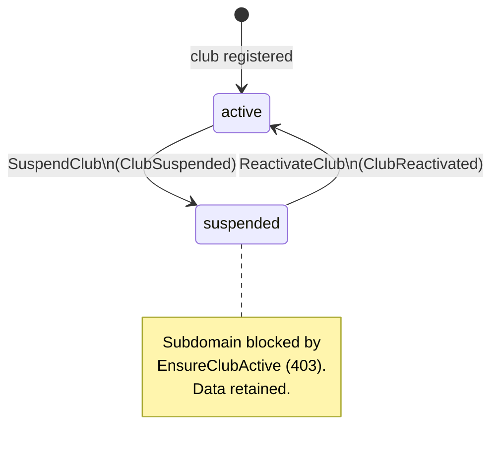
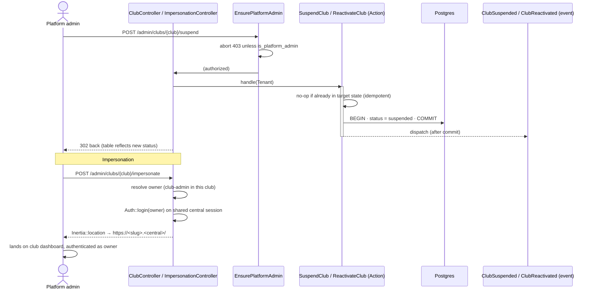

# Feature: Platform admin (central console)

A platform operator manages **every** club from the central domain: list all clubs with basic
stats, **suspend** / **reactivate** a club, and **impersonate** a club owner (log in as them and
jump into their workspace).

This is a **central** area — it runs on the apex domain (e.g. `localhost` / `lvh.me`), *outside*
any tenant context. `tenant()` is `null` here, so clubs are operated on as `Tenant` models
directly (no `BelongsToTenant` scope).

## Who can do this

A platform operator is a user with `users.is_platform_admin = true`. This is **not** a spatie
role (spatie roles are club-scoped) — it is a flag plus a `Gate::before` in
`AppServiceProvider` that bypasses every authorization check. There is no UI to grant it; it is
set out-of-band (seeder / tinker / `forceFill(['is_platform_admin' => true])`).

## Plain-English flow

1. A platform admin opens **`/admin/clubs`** on the central domain.
2. They see a table of **all clubs** with per-club counts of **members**, **courts**, and
   **tournaments**, plus each club's **status** (active / suspended).
3. They can **suspend** a club (freezes its workspace — its subdomain returns 403) or
   **reactivate** a suspended club.
4. They can **impersonate** a club's owner: the app logs them in as that owner and bounces them
   to the club's subdomain, where they land authenticated as the owner.
5. **`Open`** links jump straight to a club's subdomain workspace.

## Club lifecycle (status)

## Suspend / impersonate sequence

## Key decisions

- **Status is a real column.** `tenants.status` (string, default `active`) is added in a
  *separate* migration (not the original tenants migration) and registered in
  `Tenant::getCustomColumns()` so stancl's `VirtualColumn` keeps it a real column instead of
  folding it into the `data` JSON blob. Cast to `App\Domains\Tenancy\Enums\ClubStatus`.
- **Suspension is enforced at the edge.** `App\Http\Middleware\EnsureClubActive` runs on the
  tenant route group (after tenancy is initialized) and aborts 403 when the resolved
  `tenant()` is suspended. It is a no-op when there is no tenant context.
- **Actions are idempotent.** `SuspendClub` / `ReactivateClub` no-op (and do **not** re-emit
  their event) when the club is already in the target state. Events are
  `ShouldDispatchAfterCommit`.
- **Impersonation via shared session (not stancl tokens).** We `Auth::login()` the club owner on
  the central web guard and `Inertia::location()` to the club subdomain. The session cookie is
  shared across subdomains via `SESSION_DOMAIN` (the central domain; `lvh.me` locally), so the
  owner arrives authenticated. We deliberately avoid stancl's `UserImpersonation` /
  `ImpersonationToken` feature: it would need an extra migration and a token-consuming route on
  the tenant subdomain, whereas the shared-session login is simpler and needs no tenant-side
  plumbing. Only `is_platform_admin` users reach the action (guarded twice).
- **Per-club counts** are computed from grouped central-table aggregates
  (`tenant_user`, `courts`, `tournaments` keyed by `tenant_id`) rather than tenant-scoped
  Eloquent queries, because there is no active tenant in the central console.

## Where the code lives

| Concern | File |
| --- | --- |
| Status column | `database/migrations/2026_06_14_050101_add_status_to_tenants_table.php` |
| Status enum | `app/Domains/Tenancy/Enums/ClubStatus.php` |
| Model (status cast + `active()`/`suspended()` scopes + `isActive()`/`isSuspended()`) | `app/Domains/Tenancy/Models/Tenant.php` |
| Use cases | `app/Domains/Tenancy/Actions/SuspendClub.php`, `…/ReactivateClub.php` |
| Events | `app/Domains/Tenancy/Events/ClubSuspended.php`, `…/ClubReactivated.php` |
| Platform-admin guard | `app/Http/Middleware/EnsurePlatformAdmin.php` |
| Suspended-club guard (tenant side) | `app/Http/Middleware/EnsureClubActive.php` |
| HTTP | `app/Http/Controllers/Platform/ClubController.php`, `…/ImpersonationController.php` |
| Routes | `routes/central/platform.php` |
| UI | `resources/js/pages/platform/clubs/index.tsx`, `…/clubs/show.tsx` |

## Routes (all on the central domain, prefix `/admin`)

| Name | Method · URI | Guards |
| --- | --- | --- |
| `platform.clubs.index` | GET `/admin/clubs` | `auth`, `EnsurePlatformAdmin` |
| `platform.clubs.show` | GET `/admin/clubs/{club}` | `auth`, `EnsurePlatformAdmin` |
| `platform.clubs.suspend` | POST `/admin/clubs/{club}/suspend` | `auth`, `EnsurePlatformAdmin` |
| `platform.clubs.reactivate` | POST `/admin/clubs/{club}/reactivate` | `auth`, `EnsurePlatformAdmin` |
| `platform.clubs.impersonate` | POST `/admin/clubs/{club}/impersonate` | `auth`, `EnsurePlatformAdmin` |

`{club}` binds a `Tenant` by its primary key (the UUID `id`).

## Wiring still required (owner of shared files)

- **`EnsureClubActive` into the tenant route group.** Add it to the middleware stack in
  `routes/tenant.php`, **after** `InitializeTenancyBySubdomain` /
  `PreventAccessFromCentralDomains` and before `ForgetTenantRouteParameter`, so a suspended
  club's subdomain returns 403. Until wired, suspension only affects the central console's
  reporting, not subdomain access.
- **Dashboard link.** Optionally surface a link to `/admin/clubs` for platform admins from the
  central dashboard / nav (shared nav was intentionally not edited by this slice).
- **Event-catalog rows** for `ClubSuspended` / `ClubReactivated` (see Integration below).

## Acceptance criteria (tested)

- ✅ New clubs default to `active`.
- ✅ A platform admin can list all clubs (`platform/clubs/index`) with per-club counts.
- ✅ A platform admin can suspend then reactivate a club; status flips and events fire.
- ✅ Suspend / reactivate are idempotent and do not re-emit their event when already in state.
- ✅ `Tenant::active()` / `Tenant::suspended()` scopes filter correctly.
- ✅ A non-platform-admin gets **403** on `/admin/*`; an anonymous visitor is redirected to login.
- ✅ `EnsureClubActive` blocks a suspended tenant (403) and passes an active one.
- ✅ (E2E) A normal (non-admin) user is forbidden from `/admin/clubs`. A *full* admin E2E needs a
  **seeded platform admin** (no signup path mints one).

Tests: `tests/Feature/Platform/PlatformAdminTest.php` (Pest) ·
`tests/e2e/platform-admin.spec.ts` (Playwright).

## Integration notes

**Event catalog** — add these rows to `docs/events/event-catalog.md`:

| Event | Context | Emitted when | Listeners (queued) |
| --- | --- | --- | --- |
| `ClubSuspended` | Tenancy | A club is suspended by a platform operator (after commit) | — |
| `ClubReactivated` | Tenancy | A suspended club is reactivated (after commit) | — |

**ERD** — add to `docs/db/erd.md`: `tenants.status` (string, default `'active'`,
indexed) — club lifecycle: `active | suspended`.
