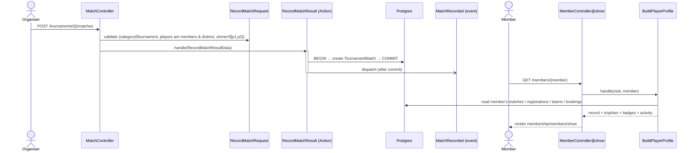

# Feature: Player profiles & competitive records

Every club member has a player profile reachable from the Members directory. It shows their
bio + club activity and — the headline — a **competitive record** and **trophy case** derived
from recorded match results.

## Plain-English flow

1. A `tournament.manage` holder (club-admin / coach) opens a tournament and **records a result**
   from the *Results* section: a category, a round, the two players, the winner, and a score.
2. The result is stored as a `TournamentMatch` (tenant-scoped) and `MatchRecorded` fires.
3. Any club member can open a fellow member from **Members → a name** to see their profile.
4. The profile **derives** from that member's matches:
   - **Record:** played / won / lost / win % / titles / finals.
   - **Trophy case:** best placement per tournament-category — **Champion** (won the final),
     **Runner-up** (lost the final), **Semi-finalist** (played a semi).
   - **Achievement badges:** earned milestones (First win, 10/25 wins, First title, Triple crown).
   - Plus recent results and club activity (tournaments entered, teams, bookings, member-since).

## Sequence

## Design notes

- **Singles-focused v1.** A match is two players (users) and a winner; doubles/team results are
  a later extension. A **title** = winning a `final`-round match.
- **Source of truth, not a flag.** Trophies and records are *derived* from `tournament_matches`
  by `BuildPlayerProfile` — there is no separate "achievements" table to keep in sync.
- **Tenant-scoped.** `TournamentMatch` uses `BelongsToTenant`; the derivation runs inside the
  club's tenancy context (the match query groups its OR so the global scope is preserved).
- **Permissions.** Recording/removing results requires `tournament.manage`; viewing a profile
  only requires being an authenticated club member.

## Where things live

| Concern | File |
| --- | --- |
| Migration / model / enum | `database/migrations/*_create_tournament_matches_table.php`, `app/Domains/Tournaments/Models/TournamentMatch.php`, `Enums/MatchRound.php` |
| DTO / action / event | `app/Domains/Tournaments/Data/RecordMatchResultData.php`, `Actions/RecordMatchResult.php`, `Events/MatchRecorded.php` |
| Record endpoint | `app/Http/Controllers/Tournaments/MatchController.php`, `app/Http/Requests/Tournaments/RecordMatchRequest.php`, `routes/tenant/tournaments.php` |
| Profile derivation | `app/Domains/Membership/Actions/BuildPlayerProfile.php`, `MemberController@show`, `routes/tenant/membership.php` |
| UI | `resources/js/pages/membership/members/show.tsx` (+ link from `index.tsx`), Results section in `resources/js/pages/tournaments/show.tsx` |
| Tests | `tests/Feature/Tournaments/MatchResultTest.php`, `tests/Feature/Membership/PlayerProfileTest.php`, `tests/e2e/player-profile.spec.ts` |
