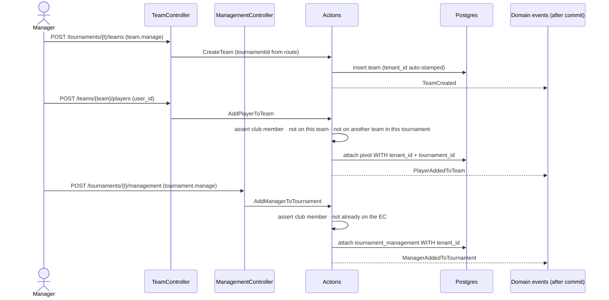

# Feature: Tournament Teams, Rosters & EC (management)

A club's **teams** (squads) and **rosters** are specific to a **tournament**, and each
tournament has an **EC** (executive committee / management) — the club members who run it.

Three rules, per the club's request:

- **A team belongs to a tournament** (`teams.tournament_id` is required) and is deleted with it.
- **A member is on only one team per tournament** — they can play for *different* teams in
  *different* tournaments, but not two teams in the same one.
- **The EC can differ from tournament to tournament** — management is a per-tournament set.

(Team players must be **club members**, as before.)

## Plain-English flow

1. A member with **`tournament.manage`** creates a tournament. On its page they can manage its
   **categories**, **registration**, **teams** and **EC**.
2. A member with **`team.manage`** (club-admin or coach) clicks **New team** on the tournament
   page — naming a squad in that tournament.
3. On the team's roster page they **add players**, picking from club members who are **not yet on
   any team in this tournament** (the picker enforces the one-team rule up front; the Action
   enforces it again on submit).
4. A member with **`tournament.manage`** adds club members to the tournament's **EC** (management)
   from the tournament page, and can remove them. The EC is independent per tournament.
5. Any **club member** can view tournaments, their teams and rosters; mutations are gated.

## Sequence

## Key invariants & decisions

- **Teams are tournament-scoped.** `teams.tournament_id` is **non-nullable** with
  `cascadeOnDelete` — deleting a tournament deletes its teams. `CreateTeam` takes the tournament
  from the route (`tournaments.teams.store`), not the request body.
- **One team per member per tournament.** Backed by a DB `unique(tournament_id, user_id)` on the
  `team_player` pivot (which now carries a denormalised `tournament_id`), and enforced with a
  friendly message in `AddPlayerToTeam::assertNotAlreadyInTournament()` → `RosterException` → 422.
  The roster picker (`TeamController::show`) also excludes anyone already on a team in this
  tournament.
- **EC is per-tournament.** `tournament_management` (a `Tournament::management()` belongs-to-many)
  holds the club members who run each tournament. `AddManagerToTournament` enforces club
  membership + no-duplicate (`ManagementException` → 422). Managing the EC requires
  **`tournament.manage`**; creating teams requires **`team.manage`** (the tournament page passes
  both `canManage` and `canManageTeams`).
- **The `attach()` tenant_id gotcha.** `attach()` bypasses model events, so `tenant_id` (and, for
  rosters, `tournament_id`) are stamped on the pivot by hand.
- **Tenant isolation.** `teams`, `team_player` and `tournament_management` all carry `tenant_id`
  and use `BelongsToTenant`/explicit pivot stamping.
- **After-commit events.** `TeamCreated`, `PlayerAddedToTeam`, `PlayerRemovedFromTeam`,
  `ManagerAddedToTournament`, `ManagerRemovedFromTournament` implement `ShouldDispatchAfterCommit`.
  No listeners are registered in this slice.

## Database

| Table | Shape |
| --- | --- |
| `teams` | `id`, `tenant_id`, **`tournament_id` → tournaments (required, cascade)**, `name`, timestamps |
| `team_player` | `id`, `tenant_id`, `team_id` → teams, **`tournament_id` → tournaments**, `user_id` → users, timestamps; **unique(`tournament_id`,`user_id`)** |
| `tournament_management` | `id`, `tenant_id`, `tournament_id` → tournaments, `user_id` → users, timestamps; **unique(`tournament_id`,`user_id`)** |

## Where the code lives

| Concern | File |
| --- | --- |
| Models | `app/Domains/Tournaments/Models/Team.php`, `Tournament.php` (added `management()`) |
| Actions | `…/Actions/{CreateTeam,AddPlayerToTeam,RemovePlayerFromTeam,AddManagerToTournament,RemoveManagerFromTournament}.php` |
| DTO | `…/Data/CreateTeamData.php` (tournamentId required) |
| Events | `…/Events/{TeamCreated,PlayerAddedToTeam,PlayerRemovedFromTeam,ManagerAddedToTournament,ManagerRemovedFromTournament}.php` |
| Exceptions | `…/Exceptions/{RosterException,ManagementException}.php` |
| HTTP | `app/Http/Controllers/Tournaments/{TeamController,RosterController,ManagementController}.php`, `app/Http/Requests/Tournaments/{TeamsStoreTeamRequest,TeamsStoreRosterPlayerRequest,StoreTournamentManagerRequest}.php` |
| Routes | `routes/tenant/{teams,tournaments}.php` |
| UI | `resources/js/pages/teams/{index,show}.tsx`, `resources/js/pages/tournaments/show.tsx` (Teams + EC sections) |

## Routes (all on `<club>.<central>`, behind `auth`)

| Name | Method + URI | Guard |
| --- | --- | --- |
| `teams.index` | GET `/teams` | member (read) |
| `teams.show` | GET `/teams/{team}` | member |
| `tournaments.teams.store` | POST `/tournaments/{tournament}/teams` | `can:team.manage` |
| `teams.destroy` | DELETE `/teams/{team}` | `can:team.manage` |
| `teams.players.store` | POST `/teams/{team}/players` | `can:team.manage` |
| `teams.players.destroy` | DELETE `/teams/{team}/players/{player}` | `can:team.manage` |
| `tournaments.management.store` | POST `/tournaments/{tournament}/management` | `can:tournament.manage` |
| `tournaments.management.destroy` | DELETE `/tournaments/{tournament}/management/{user}` | `can:tournament.manage` |

## Acceptance criteria (tested)

- ✅ A team is created **under a tournament**; `teams.tournament_id` is set.
- ✅ A club member is added to a roster; the pivot carries `tenant_id` **and** `tournament_id`.
- ✅ A non-member cannot be added (`RosterException` → 422).
- ✅ A member can be on **only one team per tournament** (second team in the same tournament → 422),
  but **can** play for teams in different tournaments.
- ✅ A player can be removed; a `team.manage`-less member is 403 when creating a team.
- ✅ A club member can be added/removed from a tournament's **EC**; a non-member is rejected (422);
  the EC **differs per tournament**; a `tournament.manage`-less member is 403.
- ✅ Teams are isolated between clubs.
- ✅ (E2E) A club-admin creates a tournament, then a team under it, and sees it listed.

Tests: `tests/Feature/Tournaments/{TeamManagementTest,TournamentEcTest}.php` (Pest) ·
`tests/e2e/teams.spec.ts` (Playwright).
