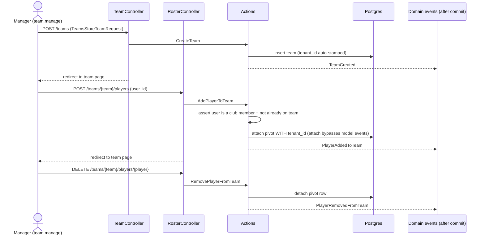

# Feature: Teams & Rosters

Lets a club create **teams** (squads) and manage their **rosters** — which club members play
on each team. A team optionally belongs to a tournament (`teams.tournament_id`, nullable), but
nothing in this slice depends on that.

> **Deferred to a later slice:** linking a team to specific tournament **categories** /
> **registrations** (entering a squad into a draw). The schema already reserves room:
> `teams.tournament_id` lets a team optionally belong to a tournament.

## Plain-English flow

1. A club member with **`team.manage`** (club-admin or coach) opens **`/teams`** and clicks
   **New team** — naming the squad. The team starts with an empty roster.
2. On the team page they **add players** — picking from the club's members (anyone in
   `tenant->users()` who is not already on the team).
3. They can **remove** a player from the roster at any time.
4. Any authenticated **club member** can **view** teams and their rosters; only `team.manage`
   holders can create/delete teams or change rosters.

## Sequence

## Key invariants & decisions

- **Authorization split.** Creating/deleting teams and all roster mutations require
  **`team.manage`** (granted to `club-admin` and `coach` in `RolePermissionSeeder::roleMatrix()`).
  Viewing teams/rosters only requires being an authenticated club member. Management routes are
  guarded with `can:team.manage`.
- **Tenant isolation.** `teams` and `team_player` both carry `tenant_id`; `Team` uses
  `BelongsToTenant`, so all queries and the `{team}` route-model binding are scoped to the
  current club.
- **The `attach()` tenant_id gotcha (critical).** `attach()` writes the pivot row with a raw
  insert that **bypasses model events**, so `BelongsToTenant` cannot auto-fill `tenant_id`.
  `AddPlayerToTeam` passes it on the pivot explicitly:
  `$team->players()->attach($player->getKey(), ['tenant_id' => $team->tenant_id])`. Forgetting
  this leaves a `tenant_id`-less (or null-constraint-violating) pivot row.
- **Roster rules live in the Action.** `AddPlayerToTeam` enforces (in one transaction) that the
  user is a member of this club (`team->tenant->users()`) and is not already on the team (also
  backed by the `unique(team_id, user_id)` index). Violations throw `RosterException`, which
  `RosterController` turns into a **422** on `user_id`.
- **After-commit events.** `TeamCreated`, `PlayerAddedToTeam`, and `PlayerRemovedFromTeam`
  implement `ShouldDispatchAfterCommit`. No listeners are registered in this slice.

## Database

No new tables or columns — the `teams` and `team_player` tables already exist.

| Table | Shape (existing) |
| --- | --- |
| `teams` | `id`, `tenant_id`, `tournament_id` (nullable) → tournaments, `name`, timestamps |
| `team_player` | `id`, `tenant_id`, `team_id` → teams, `user_id` → users, timestamps; **unique(`team_id`,`user_id`)** |

## Where the code lives

| Concern | File |
| --- | --- |
| Model (extended) | `app/Domains/Tournaments/Models/Team.php` (added `hasPlayer()` helper; `players()` + `tenant()` already present) |
| Actions | `app/Domains/Tournaments/Actions/{CreateTeam,AddPlayerToTeam,RemovePlayerFromTeam}.php` |
| DTO | `app/Domains/Tournaments/Data/CreateTeamData.php` |
| Events | `app/Domains/Tournaments/Events/{TeamCreated,PlayerAddedToTeam,PlayerRemovedFromTeam}.php` |
| Exception | `app/Domains/Tournaments/Exceptions/RosterException.php` |
| HTTP | `app/Http/Controllers/Tournaments/{TeamController,RosterController}.php`, `app/Http/Requests/Tournaments/{TeamsStoreTeamRequest,TeamsStoreRosterPlayerRequest}.php` |
| Routes | `routes/tenant/teams.php` |
| UI | `resources/js/pages/teams/{index,show}.tsx` |

## Routes (all on `<club>.<central>`, behind `auth`)

| Name | Method + URI | Guard |
| --- | --- | --- |
| `teams.index` | GET `/teams` | member |
| `teams.show` | GET `/teams/{team}` | member |
| `teams.store` | POST `/teams` | `can:team.manage` |
| `teams.destroy` | DELETE `/teams/{team}` | `can:team.manage` |
| `teams.players.store` | POST `/teams/{team}/players` | `can:team.manage` |
| `teams.players.destroy` | DELETE `/teams/{team}/players/{player}` | `can:team.manage` |

## Acceptance criteria (tested)

- ✅ A `team.manage` holder (club-admin / coach) can create a tenant-scoped team.
- ✅ A club member can be added to the roster; the `team_player` row carries the correct
  `tenant_id` (via the explicit pivot value on `attach()`).
- ✅ A non-member cannot be added (`RosterException` → 422).
- ✅ The same player cannot be added twice (`RosterException` → 422).
- ✅ A player can be removed from the roster.
- ✅ A member **without** `team.manage` is **403** when creating a team.
- ✅ Teams are isolated between clubs.
- ✅ (E2E) A club-admin creates a team via the UI and sees it listed.

Tests: `tests/Feature/Tournaments/TeamManagementTest.php` (Pest) ·
`tests/e2e/teams.spec.ts` (Playwright).
