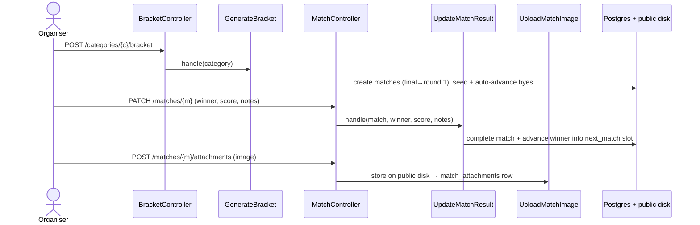

# Feature: Tournament draws (bracket & round-robin)

A tournament category's **draw** — chosen per category via its `format`:

- **Single elimination** — a visual bracket (two halves converging on a centre final + trophy);
  recording a winner advances them to the next round.
- **Round robin** — every entrant plays every other once, with an auto-ranked **standings**
  table (played / won / lost / points) plus the full fixture list.

Either way, organisers generate the draw from the confirmed entrants, then record each match's
result (winner + score), add notes, and attach images. The same `tournament_matches` rows feed
players' competitive records + trophies (see [player-profiles](player-profiles.md)).

## Plain-English flow

1. From a category on the tournament page, anyone can open its **bracket** (`/categories/{c}/bracket`).
2. A `tournament.manage` holder clicks **Generate bracket**: the confirmed entrants are seeded
   into a single-elimination draw (padded to the next power of two with byes, which auto-advance).
3. Clicking a match opens a detail dialog: pick the **winner**, enter a **score**, add **notes**,
   and **upload images**. Saving a winner advances them into the next round's open slot.

## How the draw is built

- **Size** = next power of two ≥ entrants (min 2). **Rounds** = log2(size).
- Matches are created **final-first**, so each links its `next_match_id` + `next_slot` (where the
  winner advances). Round 1 is seeded with standard bracket positions (top seeds kept apart,
  paired against byes). A round-1 match with one player is a **bye** — it auto-completes and
  advances.
- The React page splits each round's matches by position into a **left half** and **right half**,
  renders the rounds as columns converging on the centre **final + trophy**, with CSS connector
  lines — a self-contained dark "showpiece" while the rest of the app stays monochrome.

## Per-match data (the request)

- **Score** — free-form string (`6-4 6-2`).
- **Notes** — free text (`max:2000`).
- **Images** — uploaded to the `public` disk (`match-attachments/`), recorded in
  `match_attachments` (tenant-scoped); shown as a thumbnail gallery, deletable.

## Sequence

## Where things live

| Concern | File |
| --- | --- |
| Schema | `*_create_tournament_matches_table.php` (bracket fields), `*_create_match_attachments_table.php`, `*_add_format_to_tournament_categories.php` |
| Models | `TournamentMatch` (nextMatch + attachments), `MatchAttachment`; `TournamentCategory.format` |
| Actions | `GenerateBracket`, `GenerateRoundRobin`, `BuildStandings`, `UpdateMatchResult`, `UploadMatchImage` |
| Endpoints | `BracketController` (show/generate), `MatchController` (update/storeAttachment/destroyAttachment); routes in `routes/tenant/tournaments.php` |
| FormRequests | `UpdateMatchRequest`, `StoreMatchImageRequest` |
| UI | `resources/js/pages/tournaments/bracket.tsx` (branches bracket vs standings), shared `components/club/match-dialog.tsx`, format picker on `tournaments/show.tsx` |
| Tests | `tests/Feature/Tournaments/BracketTest.php`, `RoundRobinTest.php`, `tests/e2e/bracket.spec.ts` |

> Round robin reuses the same match rows (round `group`, no advancement); `BuildStandings`
> derives the table from completed ones. A category's `format` is set when it's created.

> Singles v1. A title (for the trophy case) is still "win the `final`". Doubles/team brackets and
> a draw editor are natural extensions.
