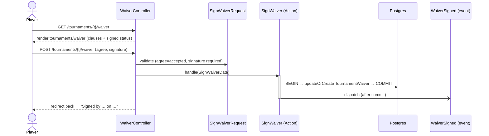

# Feature: Tournament waivers

Before competing, each player must read and **sign a liability waiver** for the tournament.
Signing is a typed-name acknowledgement (no e-signature vendor); organisers see a live
**"X of Y players signed"** roster so they can chase the stragglers.

## Plain-English flow

1. A club member opens a tournament and clicks **Sign your waiver →** (from the *Waivers*
   section on the tournament page).
2. The waiver page shows the club's standard clauses. The member ticks **"I have read and
   agree…"** and types their full name as a signature.
3. On submit, a `TournamentWaiver` row is created (or updated, if they re-sign) — tenant-scoped,
   one per `(tournament, user)` — and `WaiverSigned` fires after commit.
4. The waiver page now shows a **"Signed by … on …"** confirmation; the tournament page flips
   the member's row to a **Signed** badge.
5. An organiser (`tournament.manage`) sees the full entrant roster with **Signed / Pending**
   badges and a running signed count.

## Sequence

## Design notes

- **One row per player per tournament.** A `unique(tournament_id, user_id)` constraint plus
  `updateOrCreate` makes re-signing idempotent — the latest typed name + `signed_at` wins,
  no duplicate rows.
- **Acknowledgement, not e-signature.** v1 captures intent (checkbox + typed full name +
  timestamp), which is the common bar for club-level waivers. A vendor-backed e-signature flow
  would slot in behind the same Action/event without changing callers.
- **Tenant-scoped.** `TournamentWaiver` uses `BelongsToTenant`; waivers in one club are never
  visible to another (covered by a test).
- **Waiver text is club-standard.** The clauses come from `WaiverController::waiverText()` — a
  good seam for a future per-club editable template.
- **Permissions.** Any authenticated club member can sign *their own* waiver; the organiser
  roster (signed/pending counts) is shown only to `tournament.manage` holders.

## Where things live

| Concern | File |
| --- | --- |
| Migration / model | `database/migrations/*_create_tournament_waivers_table.php`, `app/Domains/Tournaments/Models/TournamentWaiver.php` |
| DTO / action / event | `app/Domains/Tournaments/Data/SignWaiverData.php`, `Actions/SignWaiver.php`, `Events/WaiverSigned.php` |
| Endpoint | `app/Http/Controllers/Tournaments/WaiverController.php`, `app/Http/Requests/Tournaments/SignWaiverRequest.php`, `routes/tenant/tournaments.php` |
| Tournament-page integration | `app/Http/Controllers/Tournaments/TournamentController.php` (`show`) — `waivers` + `myWaiver` props |
| UI | `resources/js/pages/tournaments/waiver.tsx`, *Waivers* section in `resources/js/pages/tournaments/show.tsx` |
| Tests | `tests/Feature/Tournaments/WaiverTest.php` |
