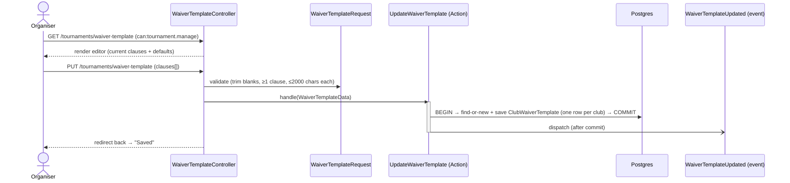

# Feature: Tournament waivers

Before competing, each player must read and **sign a liability waiver** for the tournament.
Signing is a typed-name acknowledgement (no e-signature vendor); organisers see a live
**"X of Y players signed"** roster so they can chase the stragglers. The clauses come from the
club's **editable waiver template** (each club tailors its own), and every signature
**snapshots** the exact clauses agreed to.

## Plain-English flow

1. A club member opens a tournament and clicks **Sign your waiver →** (from the *Waivers*
   section on the tournament page).
2. The waiver page shows the club's clauses, with `{tournament}` resolved to this tournament's
   name. The member ticks **"I have read and agree…"** and types their full name as a signature.
3. On submit, a `TournamentWaiver` row is created (or updated, if they re-sign) — tenant-scoped,
   one per `(tournament, user)` — capturing the signature **and the resolved clauses**
   (`signed_clauses`). `WaiverSigned` fires after commit.
4. The waiver page now shows a **"Signed by … on …"** confirmation rendering the snapshot; the
   tournament page flips the member's row to a **Signed** badge.
5. An organiser (`tournament.manage`) sees the full entrant roster with **Signed / Pending**
   badges and a running signed count, and an **Edit template** link.

## Editable template & clause snapshot

Each club owns an ordered list of waiver clauses (`ClubWaiverTemplate`, one row per club).
Organisers edit it in the Tournaments area (add / remove / reorder clauses); a clause may
contain the `{tournament}` placeholder, substituted with the tournament's name when shown to or
signed by a player. A club that has never customised its template falls back to the platform
defaults (`DefaultWaiver::clauses()`).

Editing the template **never** changes what a past signer agreed to: each signature snapshots
its own resolved clauses onto `tournament_waivers.signed_clauses`. Re-signing adopts the
current template (and refreshes the snapshot).

## Design notes

- **One row per player per tournament.** A `unique(tournament_id, user_id)` constraint plus
  `updateOrCreate` makes re-signing idempotent — the latest typed name + `signed_at` +
  `signed_clauses` win, no duplicate rows.
- **Acknowledgement, not e-signature.** v1 captures intent (checkbox + typed full name +
  timestamp + clause snapshot), the common bar for club-level waivers. A vendor-backed
  e-signature flow would slot in behind the same Action/event without changing callers.
- **Clause snapshot for integrity.** The waiver page shows the *snapshot* once signed (what the
  player actually agreed to), and the *live resolved template* before signing — so editing the
  template can never retroactively alter a recorded agreement.
- **One template per club.** `ClubWaiverTemplate` has a `unique(tenant_id)`; the resolver
  (`ClubWaiverTemplate::clausesForClub()`) returns the custom clauses or the platform defaults.
- **Tenant-scoped.** Both `TournamentWaiver` and `ClubWaiverTemplate` use `BelongsToTenant`;
  waivers and templates in one club are never visible to another (covered by tests).
- **Permissions.** Any authenticated club member can sign *their own* waiver; editing the
  template and viewing the signed/pending roster require `tournament.manage`.

## Where things live

| Concern | File |
| --- | --- |
| Migrations | `database/migrations/*_create_tournament_waivers_table.php`, `*_create_club_waiver_templates_table.php`, `*_add_signed_clauses_to_tournament_waivers_table.php` |
| Models | `app/Domains/Tournaments/Models/TournamentWaiver.php`, `ClubWaiverTemplate.php` |
| Default clauses + `{tournament}` resolver | `app/Domains/Tournaments/Support/DefaultWaiver.php` |
| Signing — DTO / action / event | `app/Domains/Tournaments/Data/SignWaiverData.php`, `Actions/SignWaiver.php`, `Events/WaiverSigned.php` |
| Template — DTO / action / event | `app/Domains/Tournaments/Data/WaiverTemplateData.php`, `Actions/UpdateWaiverTemplate.php`, `Events/WaiverTemplateUpdated.php` |
| Endpoints | `app/Http/Controllers/Tournaments/WaiverController.php`, `WaiverTemplateController.php`, `app/Http/Requests/Tournaments/SignWaiverRequest.php`, `WaiverTemplateRequest.php`, `routes/tenant/tournaments.php` |
| Tournament-page integration | `app/Http/Controllers/Tournaments/TournamentController.php` (`show`) — `waivers` + `myWaiver` props |
| UI | `resources/js/pages/tournaments/waiver.tsx`, `waiver-template.tsx`, *Waivers* section in `tournaments/show.tsx` |
| Tests | `tests/Feature/Tournaments/WaiverTest.php`, `WaiverTemplateTest.php`, `tests/e2e/waiver-template.spec.ts` |
