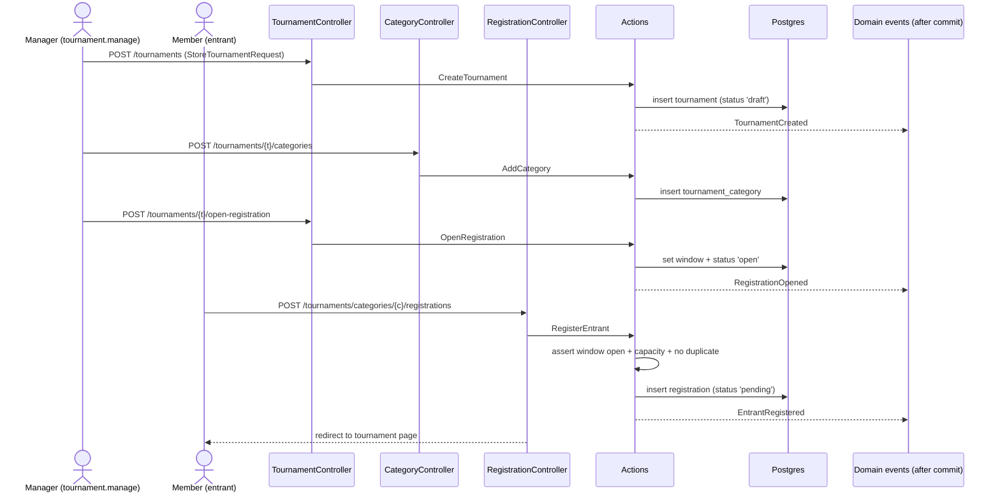

# Feature: Tournaments (core management)

Lets a club create and manage tournaments, define their **categories** (singles / doubles /
mixed), **open registration** within a date window, and let members **register** themselves
(optionally with a partner) and **withdraw**.

> **Deferred to a later slice:** draw / bracket generation, match scheduling, scoring, and
> standings / brackets. This slice only models tournaments, categories, and registrations.
> The schema is designed so those can be added later: `tournaments.format`, the per-category
> entrant list, and the `registrations.seed` column all reserve room for a draw engine.

## Plain-English flow

1. A club member with **`tournament.manage`** (club-admin or coach) opens **`/tournaments`**
   and clicks **New tournament** — naming it and choosing a **format**
   (single elimination / round robin) and optional play dates. It starts in **`draft`**.
2. On the tournament page they **add categories** (e.g. "Men's Singles", "Mixed Doubles"),
   each with a type and an optional **max entrants** cap.
3. They **open registration**, setting a **window** (`opens_on` / optional `closes_on`). The
   tournament status flips to **`open`**.
4. Any authenticated **club member** can now **register** themselves into a category (a
   doubles/mixed registration may name a **partner**). Registration is rejected if the window
   is closed, the category is **full**, or they are **already registered**.
5. A member may **withdraw** their own registration; a manager may withdraw anyone's.

## Sequence

## Key invariants & decisions

- **Authorization split.** Creating/managing tournaments & categories and opening
  registration require **`tournament.manage`** (granted to `club-admin` and `coach` in
  `RolePermissionSeeder::roleMatrix()`). Registering/withdrawing an entrant only requires being
  an authenticated club member. Management routes are guarded with `can:tournament.manage`;
  `TournamentPolicy` mirrors this for completeness.
- **Tenant isolation.** Every table carries `tenant_id` and every model uses
  `BelongsToTenant`, so all queries and route-model bindings are automatically scoped to the
  current club.
- **DB-neutral enums.** `format`, category `type`, and registration `status` are PHP
  `enum … : string` cast onto `string` columns — never DB enums ([ADR-0001](../adr/0001-postgres-but-db-neutral.md)).
- **Registration rules live in the Action.** `RegisterEntrant` enforces (in one transaction)
  the open window, the per-category capacity (`max_entrants`, ignoring withdrawn entrants), and
  the no-duplicate rule (also backed by a `unique(category_id, user_id)` index). Violations
  throw `RegistrationException`, which the controller turns into a 422.
- **After-commit events.** `TournamentCreated`, `RegistrationOpened`, and `EntrantRegistered`
  implement `ShouldDispatchAfterCommit` ([ADR-0003](../adr/0003-events-not-event-sourcing.md)).
  No listeners are registered in this slice.

## Database

| Table | New / changed columns |
| --- | --- |
| `tournaments` (existing) | **added** `format` (string, default `single_elimination`), `registration_opens_on` / `registration_closes_on` (date, nullable) |
| `tournament_categories` (new) | `id`, `tenant_id`, `tournament_id` → tournaments, `name`, `type` (singles/doubles/mixed), `max_entrants` (int, nullable), timestamps |
| `registrations` (new) | `id`, `tenant_id`, `tournament_id` → tournaments, `category_id` → tournament_categories, `user_id` → users, `partner_id` (nullable) → users, `seed` (int, nullable), `status` (pending/confirmed/withdrawn), timestamps; **unique(`category_id`,`user_id`)** |

## Where the code lives

| Concern | File |
| --- | --- |
| Migrations | `database/migrations/2026_06_14_030101_add_format_and_registration_dates_to_tournaments_table.php`, `…030102_create_tournament_categories_table.php`, `…030103_create_registrations_table.php` |
| Enums | `app/Domains/Tournaments/Enums/{CategoryType,RegistrationStatus,TournamentFormat}.php` |
| Models | `app/Domains/Tournaments/Models/{Tournament,TournamentCategory,Registration}.php` |
| Actions | `app/Domains/Tournaments/Actions/{CreateTournament,AddCategory,OpenRegistration,RegisterEntrant}.php` |
| DTOs | `app/Domains/Tournaments/Data/{CreateTournamentData,AddCategoryData,OpenRegistrationData,RegisterEntrantData}.php` |
| Events | `app/Domains/Tournaments/Events/{TournamentCreated,RegistrationOpened,EntrantRegistered}.php` |
| Exception | `app/Domains/Tournaments/Exceptions/RegistrationException.php` |
| Policy | `app/Domains/Tournaments/Policies/TournamentPolicy.php` |
| HTTP | `app/Http/Controllers/Tournaments/{TournamentController,CategoryController,RegistrationController}.php`, `app/Http/Requests/Tournaments/*` |
| Routes | `routes/tenant/tournaments.php` |
| UI | `resources/js/pages/tournaments/{index,show,create}.tsx` |

## Routes (all on `<club>.<central>`, behind `auth`)

| Name | Method + URI | Guard |
| --- | --- | --- |
| `tournaments.index` | GET `/tournaments` | member |
| `tournaments.show` | GET `/tournaments/{tournament}` | member |
| `tournaments.create` | GET `/tournaments/create` | `can:tournament.manage` |
| `tournaments.store` | POST `/tournaments` | `can:tournament.manage` |
| `tournaments.categories.store` | POST `/tournaments/{tournament}/categories` | `can:tournament.manage` |
| `tournaments.open-registration` | POST `/tournaments/{tournament}/open-registration` | `can:tournament.manage` |
| `tournaments.registrations.store` | POST `/tournaments/categories/{category}/registrations` | member |
| `tournaments.registrations.destroy` | DELETE `/tournaments/registrations/{registration}` | member (own) / manager (any) |

## Acceptance criteria (tested)

- ✅ A `tournament.manage` holder can create a tenant-scoped tournament (`draft`).
- ✅ A category can be added; registration can be opened (window + `open` status).
- ✅ A member can register an entrant; `EntrantRegistered` is dispatched.
- ✅ Registration is rejected when at capacity, a duplicate, or the window is closed.
- ✅ A member without `tournament.manage` is **403** when creating a tournament.
- ✅ Tournaments are isolated between clubs.
- ✅ (E2E) A club-admin creates a tournament via the UI and sees it listed.

Tests: `tests/Feature/Tournaments/TournamentManagementTest.php` (Pest) ·
`tests/e2e/tournaments.spec.ts` (Playwright).
